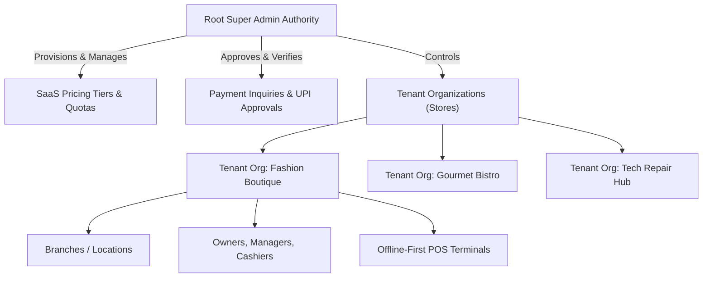

# OneDesk360 Cloud POS & Multi-Tenant Retail Ecosystem
## Comprehensive System Architecture & Functional Specification

---

## 1. Executive System Overview

**OneDesk360** is a full-stack, enterprise-grade, multi-tenant Cloud Point-of-Sale (POS) and Enterprise Resource Planning (ERP) platform. Engineered for single-store retailers, franchise chains, hospitality venues, service shops, and wholesale distributors, OneDesk360 unifies offline billing, real-time inventory management, procurement, CRM, double-entry financial accounting, and multi-tenant SaaS provisioning into a high-performance progressive web platform.

### Core Technology Stack
- **Application Framework**: TanStack Start (Full-stack React with Server Functions & File-based Routing)
- **Runtime & Deployment**: Nitro Engine / Cloudflare Modules / Node.js Serverless Edge
- **Database Layer**: PostgreSQL (Neon Serverless / Cloud Postgres) orchestrated via Drizzle ORM
- **Client Cache & State**: TanStack React Query + Persistent Session Stores
- **Offline-First Storage**: Dexie.js (IndexedDB local database with sync engine)
- **PWA & Service Worker**: Workbox Progressive Web App with offline caching & background sync
- **UI Architecture**: Tailwind CSS, Radix UI primitives, Lucide Icons, Recharts, Framer Motion

---

## 2. Platform Multi-Tenancy & SaaS Architecture

OneDesk360 features a multi-tenant hierarchy where data across tenants is isolated through row-level organizational scoping (`orgId`), while permitting platform super administrators to manage global quotas, pricing tiers, and subscriptions.

### Key Multi-Tenant Features:
- **Tenant Isolation**: Every database record (products, sales, customers, accounts, users) is strictly bound to its tenant `orgId`.
- **Dynamic Feature Flags & Module Grants**: Super Admins can grant or restrict any of the 28 system modules per tier or on a per-tenant override basis.
- **Granular Quota Enforcement**: Real-time quota enforcement on maximum staff users, product SKU count, store branches, and monthly invoice generation.
- **Trial Lifecycle Management**: Automated trial duration countdowns, custom grace period extensions, and instant store suspension/reactivation.

---

## 3. Super Admin Platform Operations (`/admin`)

The Super Admin suite provides universal governance over all tenant stores:

### 3.1. Executive Dashboard (`/admin/dashboard`)
- **Key Metrics Strip**: Monthly Recurring Revenue (MRR), Annual Recurring Revenue (ARR), Total Stores, Active vs. Trial Subscriptions, Pending Payment Inquiries, and Open Support Tickets.
- **Visual Analytics**: Interactive MRR revenue velocity charts and SaaS plan distribution breakdown.
- **Infrastructure Health**: Real-time monitoring of SSR edge runtimes, PostgreSQL connection health, and PWA sync engine status.
- **Quick Action Triggers**: Instant tenant store provisioning, 1-click trial extensions, and live CSV data exports.

### 3.2. Tenant Stores & Organizations (`/admin/tenants`)
- **Store Directory**: Search, filter by status (`Active`, `Trial`, `Suspended`), and filter by assigned SaaS plan.
- **Tenant Management Drawer**:
  - **General Settings**: Update store name, owner contact, email, and location.
  - **Subscription Controls**: Switch pricing plans, adjust expiry dates, toggle auto-renewal, and extend trial days.
  - **Module Access Grants**: Granular checkboxes to enable/disable any of the 28 application modules for that specific tenant.
  - **Security & Password Reset**: Reset store owner master passwords.
  - **Danger Zone**: One-click store suspension, unsuspension, or permanent database purge.
- **Provisioning Engine**: Instant setup of new tenant stores with owner credentials, assigned SaaS plan, and initial currency formatting.

### 3.3. SaaS Plans & Quota Management (`/admin/plans`)
- **Tier Configuration**: Create, edit, clone, or delete unlimited SaaS pricing plans.
- **Dual Billing Cadence**: Define monthly prices and discounted annual commitment pricing in dynamic currencies (`INR`, `USD`, `EUR`, `GBP`, `AED`, `SAR`, etc.).
- **Quota Limits**: Set ceiling values for max staff users, product catalogue limits, multi-store branch limits, and monthly invoice allowances.
- **28 Bundled System Modules**: 1-click selection across 6 functional categories.
- **Default Trial Tier**: Designate a default tier automatically assigned to new merchant registrations.

### 3.4. Payment Approvals & Bank Setup (`/admin/payments`)
- **Manual / Bank Transfer Gateway**: Offline payment gateway supporting direct Bank NEFT/RTGS/IMPS and UPI QR code payments.
- **Payment Verification Drawer**: View merchant payment proof, bank reference number (UTR), submitted transaction amount, and timestamp.
- **Approval Workflow**: 1-click approve (automatically updates the store's subscription duration and marks invoice paid) or reject with merchant feedback.
- **Super Admin Bank & UPI QR Setup**: Configure official Super Admin bank details (Account Name, Account Number, Bank Name, IFSC / Swift Code, UPI ID, and QR code image URL).

### 3.5. Merchant Help Desk & Support (`/admin/support`)
- **Ticketing System**: View, triage, and resolve merchant support requests submitted from store admin dashboards.
- **Status Workflows**: Transition tickets between `Open`, `In Progress`, `Resolved`, and `Closed`.
- **Store Navigation Shortcut**: Direct shortcut to view merchant store details directly from the ticket drawer.

### 3.6. Merchant Reviews & Feedback (`/admin/reviews`)
- **Quality & Satisfaction Feed**: Real-time merchant review feed with star ratings (1 to 5 stars), written testimonials, and store timestamps.

### 3.7. Broadcast Announcements & Alert Banners (`/admin/announcements`)
- **System-Wide Alerts**: Broadcast notices that immediately render as persistent or dismissible alert banners across all active merchant store dashboards.
- **Priority Levels**: Info, Warning, Success, and Critical System Maintenance alerts with scheduled start/end dates.

### 3.8. Platform Personnel (`/admin/users`)
- **Root Super Administrators Directory**: Manage super admin accounts with Argon2/Bcrypt password encryption.
- **Active Sessions Audit**: View active super admin JWT login sessions, IP locations, and last-activity timestamps.

### 3.9. Super Admin Profile & Master Security Drawer
- **Personal Details**: Update Super Admin Name and Email Address.
- **Master Password Change**: Secure password updates with current password verification.

---

## 4. Store Admin & POS Core Modules

### 4.1. POS Terminal (`/pos`)
- **High-Velocity Checkout**: Barcode scanning, item keyword search, visual category grid, and one-touch numerical keypad.
- **Multi-Payment Tender**: Cash, Credit/Debit Card, UPI QR code, Split Tender (Cash + Card), Customer Ledger (On Account / Credit), and Gift Cards.
- **Hold & Park Carts**: Suspend multiple in-progress shopping carts and resume instantly for high-traffic environments.
- **Dynamic Discounts & Line Modifiers**: Apply percentage or fixed discounts per item line or to the overall bill with tax computation.
- **Hardware Integration**: High-speed ESC/POS 80mm & 58mm thermal receipt printing, Cash Drawer automatic kick protocols, and customer-facing secondary displays.
- **Offline Resilience**: Continues billing during network downtime, storing transactions locally in IndexedDB and syncing automatically when back online.

### 4.2. Product & Catalog Management (`/products`, `/categories`, `/brands`, `/units`)
- **Product Architecture**: Single SKU products, variant matrix items (Size, Color, Material), serialized items, and service items.
- **Pricing & Margin Control**: Purchase Cost, Selling Price, Wholesale Price, Minimum Selling Price (floor protection), and automatic markup calculations.
- **Taxation Engine**: Inclusive or Exclusive tax rules with Multi-Rate GST / VAT / Sales Tax breakdown.
- **Barcode Engine**: Auto-generate Code128, EAN13, and UPC barcodes with customizable printable label sheets.

### 4.3. Inventory Master & Stock Movements (`/inventory`)
- **Real-Time Stock Tracking**: Live quantity on hand, low-stock reorder triggers, out-of-stock indicators, and valuation (FIFO / Average Cost).
- **Stock Adjustments**: Record inventory discrepancies (Damaged, Expired, Theft, Internal Use, Audit Recalibration).
- **Multi-Branch Stock Transfers**: Transfer stock between central warehouses and branch outlets with in-transit status tracking.
- **Stock Movement History**: Comprehensive audit ledger of every unit added, sold, returned, or adjusted.

### 4.4. Sales & Invoicing (`/sales`, `/sales/returns`, `/quotations`, `/delivery-challans`)
- **Sales Invoices**: Printable thermal receipts and standard A4/A5 commercial invoices with customizable branding, terms, and QR codes.
- **Sales Returns & Refunds**: Process full or partial returns against original invoices, automatically restock inventory, and issue cash refunds or customer store credits.
- **Quotations & Estimates**: Create professional customer estimates with one-click conversion to finalized sales orders.
- **Delivery Challans**: Dispatch goods with delivery notes, transporter tracking, vehicle numbers, and proof-of-delivery tracking.

### 4.5. Purchases & Vendor Management (`/purchases`, `/suppliers`)
- **Purchase Orders (PO)**: Generate and issue POs to suppliers, track partial shipments, and log vendor invoices against received goods.
- **Purchase Returns**: Return damaged or excess stock to vendors with debit note generation and balance adjustments.
- **Supplier Ledger**: Maintain supplier directories, credit limits, payment terms, and historical purchase records.

### 4.6. Customers & Loyalty Marketing (`/customers`, `/loyalty`, `/coupons`, `/gift-cards`, `/promotions`)
- **Customer CRM Profiles**: Customer purchase history, lifetime value, outstanding credit balances, and loyalty point totals.
- **Loyalty Program**: Configurable reward points earned per dollar spent, minimum redemption thresholds, and instant checkout redemptions.
- **Coupons & Promotional Rules**: Time-bound promo codes, minimum spend thresholds, buy-one-get-one (BOGO) rules, and category-level discounts.
- **Gift Cards**: Issue digital or physical gift cards with unique alphanumeric codes and track balance usage.
- **WhatsApp Integration**: Send digital invoice receipts and promo announcements directly to customer WhatsApp numbers.

### 4.7. Finance, Expenses & Double-Entry Accounting (`/expenses`, `/accounts`, `/reports`, `/accounting-reports`)
- **Chart of Accounts**: Assets, Liabilities, Equity, Revenue, and Expenses ledgers.
- **Expense Tracking**: Categorized store operational expenses (Rent, Utilities, Salaries, Logistics) with receipt attachments.
- **Cash Register & Shifts**: Open/close cash drawer shifts, cash floating amounts, cash drop logs, and expected vs. actual reconciliation.
- **Financial Statements**:
  - Profit & Loss (Income Statement) with Gross Margin & Net Profit.
  - Balance Sheet (Assets vs. Liabilities & Equity).
  - Trial Balance & General Ledger Audit Trail.
  - Tax Summary & GST / VAT Filings Breakdown.

---

## 5. Specialized Industry Vertical Solutions

OneDesk360 includes specialized business template configurations:

| Business Vertical | Specialized Modules & Workflow Features |
| :--- | :--- |
| **Retail & Apparel** | Variant matrix (Size / Color), seasonal promotions, barcode sticker printing, customer loyalty. |
| **Supermarket & Grocery** | High-speed barcode scanning, digital weighing scale integration, loose produce pricing, batch tracking. |
| **Restaurant, Cafe & Bar** | Dine-in Table layout management, Kitchen Display System (KDS), Kitchen Order Tickets (KOT), split checks. |
| **Electronics & Repair** | Repair job sheets, device IMEI/Serial tracking, technician assignment, repair status tracking. |
| **Equipment & Tool Rental** | Daily/weekly rental checkouts, security deposit handling, item return inspection, late fee penalties. |
| **Salon, Spa & Clinic** | Client appointment slot booking, service duration scheduling, specialist commission tracking. |
| **Wholesale & Distribution** | Tiered wholesale pricing, customer credit ledgers, delivery challans, bulk quotations. |

---

## 6. Security, Authentication & Role Permissions

### 6.1. Role-Based Access Control (RBAC)
- **Super Admin**: Unrestricted multi-tenant control, billing gateway, and server configuration.
- **Store Owner / Super Administrator**: Full store access across all enabled modules, staff management, and financial ledgers.
- **Store Manager**: Access to inventory, purchases, day-to-day sales, customer records, and operational reports.
- **Cashier**: Focused POS terminal access, sales creation, register shifts, and customer lookups.
- **Kitchen / Technician Staff**: Restricted access to active KOT orders or assigned repair job sheets.

### 6.2. Cryptographic Security Standards
- **Password Hashing**: Bcrypt / Argon2 with adaptive work factors.
- **Authentication**: JWT-based session tokens with http-only secure cookies.
- **API Guard**: Strict session validation middleware on all backend server functions preventing cross-tenant data leaks.

---

## 7. Data Synchronization & Offline-First Protocol

1. **Local Writes**: POS billing and inventory lookups execute directly against local IndexedDB (Dexie.js), eliminating network latency.
2. **Background Queue**: All finalized sales and stock mutations are appended to a persistent synchronization queue.
3. **Automatic Reconciliation**: When network connectivity is detected, the ServiceWorker flushes queued transactions to the PostgreSQL server.
4. **Conflict Resolution**: Server-side timestamp ordering and inventory lock management prevent duplicate invoice creation.

---

## 8. Summary Checklist of System Capabilities

- [x] **Universal Multi-Tenant Cloud Architecture**
- [x] **28 Configurable Business Modules**
- [x] **Dedicated Super Admin Executive Suite**
- [x] **Multi-Currency Engine (₹, $, €, £, AED, SAR, etc.)**
- [x] **Double-Entry Financial Accounting & P&L**
- [x] **Offline-First POS Terminal with Thermal Printing**
- [x] **Comprehensive CRM, Loyalty Points & Coupons**
- [x] **Specialized Industry Verticals (Dining, Repair, Rental, Retail, Wholesale)**
- [x] **Responsive Desktop, Tablet & Mobile App Layouts**
- [x] **Full-Text Global Search & AI Copilot Assistant**
